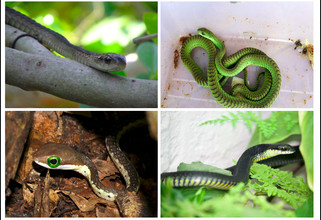
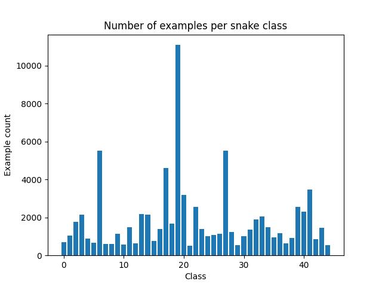
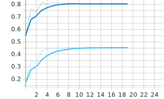
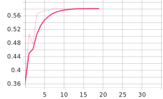
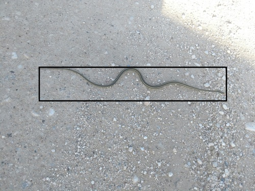
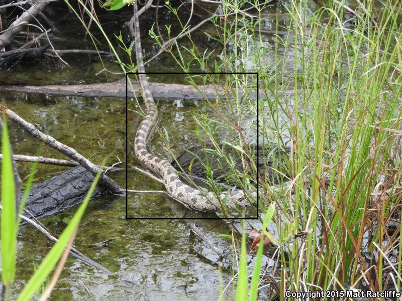
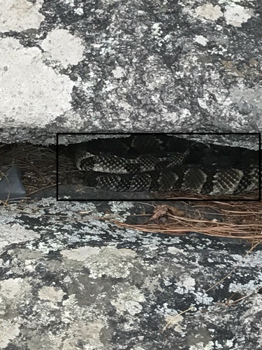
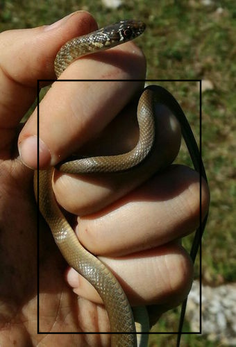

### Identify snake species from images
This repo contains code to classify the species of snakes given images of varied sources, as part of the [Snake species identification challenge](https://www.aicrowd.com/challenges/snakeclef2021-snake-species-identification-challenge) on the [AICrowd](https://www.aicrowd.com/) platform.

The goal of the challenge is to provide a classification algorithm to better determine which antivenom to administer to a victim of a snakebite, given a photo of the snake.

The input images are very diverse (urban/nature background) and a snake can be located all over image. Here are some examples of input images:  

The data set consists of 45 classes is quite unbalanced:

Some descriptive statistics of the number of examples:
* median = 1232
* mean = 1836
* stdev = 1839
* min/max = 517/11092

#### Modelling approach
* Create a segmentation model that will create a bounding box around the snake in a given image.
* Create a classification model with input the segmented snake image.

##### Segmentaion model
To create the segmentation model there was the need to create a segmented training set first. Using [Label Studio](https://github.com/heartexlabs/label-studio), the snakes in 900 images were annotated.  
The annotated images were used to fine-tune a pre-trained Faster R-CNN model using PyTorch. An 80/20 split was used for training/test images for 20 epochs with a random horizontal flip for data augmentation. Training metrics were plotted to tensorboard.

Below is the training loss over 20 epochs:  
  

The loss is minimized around epoch 9 and then again around epoch 13. The segmentation to be used in the classification pipeline was trained for 13 epochs. The performance metrics on the test set support stopping at epoch 13 in stead of epoch 9 in this case.

Below is the mean average precision for an IoU=0.50 (dark blue line) as well as for an IoU=0.50:0.95 (light blue line) for the duration of 20 epochs:  
  
Around epoch 11-13 the performance curve levels off around **mAP=0.81 for IoU=0.50** and **mAP=045 for IoU=0.95**

Here is the curve for the average recall over 20 epochs:  

Around epoch 13 the performance levels off around **R=0.58**

Both these metrics support the decision to stop training the segmentation model after 13 epochs. The model performs quite well at segmenting out the snakes from a given out-of-training sample image, some examples of segmentations:  

  

  

In the above images is it clear that the segmentation model can do quite well. In the two images on the left the shape of the snake is not obstructed by some other object. In the images on the right side, the model struggles a bit because part of the snake is partly obstructed from view.  
Overall though, the segmentation model does quite well and will benefit the performance of a classification model in a preprocessing step.

#### Classification model (WIP)
* Preprocess the input images using the segmentation model
* Fine tune (probably) resnet101 for the classification task
